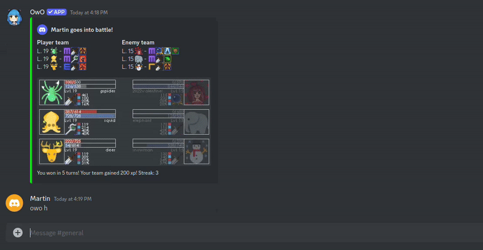

# Automated OwO Hunt and Battle

[OwO](https://owobot.com/) is a Discord interactive game where the player can hunt animals and battle with them. However, this game
throttles the number of hunts and battles (one every 15 seconds). This Python script will take care of hunting and battling
as soon as it is available, without any human intervention. This makes it very cheap to level up animals.

## Demo



## Bot Detection Algorithm

The logic describing the bot detection algorithm designed by OwO is kept secret, for obvious reasons. However, an older version can be found [here](https://github.com/ChristopherBThai/Discord-OwO-Bot/blob/645ab1d4bad5f72d961fb90a4ade06f19564a31a/util/macro.js).
Unless proven otherwise, we can assume that it has not changed significantly.

Essentially, if the player runs more than X commands within Y minutes, OwO will suspect some bot usage and ask the user to verify a captcha.
The player will be banned for Z hours if they fail to verify the captcha within 10 minutes.

The different checks (values for X, Y and Z) are below:

| Max number of commands | Within  | Ban duration |
|------------------------|---------|--------------|
| 1                      | 1.5 sec | 1h           |
| ~250                   | 30 min  | 12h          |
| ~1000                  | 6h      | 36h          |

So, to respect these constraints, the approach we take in this script is to run 1000 commands in around 2 hours; 
then one can stop for 4 hours and repeat, if desired.

## Installation

```shell
git clone git@github.com:MartinBraquet/owo.git
cd owo
pip install -e .
```

## Usage

### Configure credentials

Set up the following in the [credentials](credentials) file:
- your Discord username
- your Discord password
- the Discord URL of the server where your OwO game is set up

Note: the code in this repository will not share your credentials nor use it for any other purpose
than logging in on your machine and run the owo commands.

### Run

Run this Python script from anywhere.

```python
import owo

owo.run()
```

## Feedback

For any issue / bug report / feature request,
open an [issue](https://github.com/MartinBraquet/owo/issues).

## Contributions

To provide upgrades or fixes, open a [pull request](https://github.com/MartinBraquet/owo/pulls).

## Disclaimer

This script might be violating some Discord or OwO guidelines; running it for too long
might block your OwO game for 1h, 12h, 36h, or permanently.

